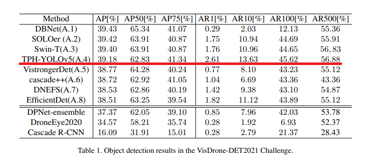

# TPH-YOLOv5
This repo is the implementation of ["TPH-YOLOv5: Improved YOLOv5 Based on Transformer Prediction Head for Object Detection on Drone-Captured Scenarios"](https://openaccess.thecvf.com/content/ICCV2021W/VisDrone/html/Zhu_TPH-YOLOv5_Improved_YOLOv5_Based_on_Transformer_Prediction_Head_for_Object_ICCVW_2021_paper.html).   
On [VisDrone Challenge 2021](http://aiskyeye.com/), TPH-YOLOv5 wins 4th place and achieves well-matched results with 1st place model.
  
You can get [VisDrone-DET2021: The Vision Meets Drone Object Detection Challenge Results](https://openaccess.thecvf.com/content/ICCV2021W/VisDrone/html/Cao_VisDrone-DET2021_The_Vision_Meets_Drone_Object_Detection_Challenge_Results_ICCVW_2021_paper.html) for more information.

# Install
```bash
$ git clone https://github.com/cv516Buaa/tph-yolov5
$ cd tph-yolov5
$ pip install -r requirements.txt
```
# Convert labels
VisDrone2YOLO_lable.py transfer VisDrone annotiations to yolo labels.  
You should set the path of VisDrone dataset in VisDrone2YOLO_lable.py first.
```bash
$ python VisDrone2YOLO_lable.py
```

# Inference
* `Datasets` : [VisDrone](http://aiskyeye.com/download/object-detection-2/)
* `Weights` (PyTorch
v1.10): 
    * `yolov5l-xs-1.pt`:  | [Baidu Drive(pw: vibe)](https://pan.baidu.com/s/1APETgMoeCOvZi1GsBZERrg). |  [Google Drive](https://drive.google.com/file/d/1w-utUKt_FMfpW8vJUddTQvh-qC4pw4m9/view?usp=sharing) |
    * `yolov5l-xs-2.pt`:  | [Baidu Drive(pw: vffz)](https://pan.baidu.com/s/19S84EevP86yJIvnv9KYXDA). |  [Google Drive](https://drive.google.com/file/d/1tZ0rM4uj1HGsZtqaE2gryb25ADmjiMYu/view?usp=sharing) |
    
val.py runs inference on VisDrone2019-DET-val, using weights trained with TPH-YOLOv5.  
(We provide two weights trained by two different models based on YOLOv5l.)

```bash
$ python val.py --weights ./weights/yolov5l-xs-1.pt --img 1996 --data ./data/VisDrone.yaml
                                    yolov5l-xs-2.pt
--augment --save-txt  --save-conf --task val --batch-size 8 --verbose --name v5l-xs
```


# Ensemble
If you inference dataset with different models, then you can ensemble the result by weighted boxes fusion using wbf.py.  
You should set img path and txt path in wbf.py.
```bash
$ python wbf.py
```

# Train
train.py allows you to train new model from strach.
```bash
$ python train.py --img 1536 --batch 2 --epochs 80 --data ./data/VisDrone.yaml --weights yolov5l.pt --hy data/hyps/hyp.VisDrone.yaml --cfg models/yolov5l-xs-tr-cbam-spp-bifpn.yaml --name v5l-xs
```
  

# Description of TPH-YOLOv5 and citation
- https://arxiv.org/abs/2108.11539
- https://openaccess.thecvf.com/content/ICCV2021W/VisDrone/html/Zhu_TPH-YOLOv5_Improved_YOLOv5_Based_on_Transformer_Prediction_Head_for_Object_ICCVW_2021_paper.html  

If you have any question, please discuss with me by sending email to adlith@buaa.edu.cn  
If you find this code useful please cite:
```
@inproceedings{zhu2021tph,
  title={TPH-YOLOv5: Improved YOLOv5 Based on Transformer Prediction Head for Object Detection on Drone-captured Scenarios},
  author={Zhu, Xingkui and Lyu, Shuchang and Wang, Xu and Zhao, Qi},
  booktitle={Proceedings of the IEEE/CVF International Conference on Computer Vision},
  pages={2778--2788},
  year={2021}
}
```

# References
Thanks to their great works
* [ultralytics/yolov5](https://github.com/ultralytics/yolov5)
* [WBF](https://github.com/ZFTurbo/Weighted-Boxes-Fusion)